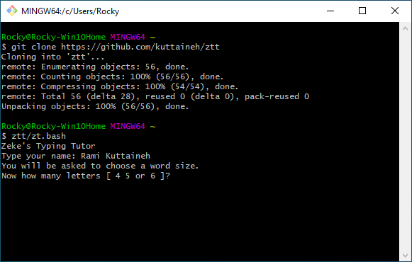

# ztt
a cross-platform typing tutor which speaks and gives positive feedback

Installation, from a terminal type:
```
git clone https://github.com/kuttaineh/ztt.git
cd ztt
```
MacOS ONLY:
```
echo "bash $HOME/ztt/ztt.bash">ztt
```
Both Linux & MacOS:
```
chmod +x ztt
sudo mv ztt /usr/local/bin
```
To run on Linux & MacOS, simply type:
```
ztt
```
Windows:

To install git on windows https://gitforwindows.org
```
git clone https://github.com/kuttaineh/ztt.git
ztt/zzt.bash
```



