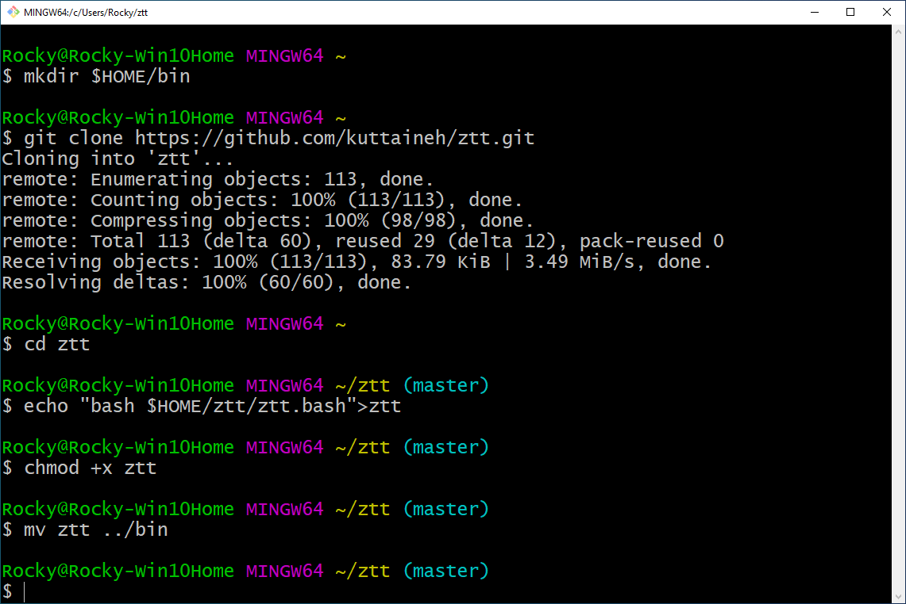

# ztt
a cross-platform typing tutor which speaks and gives positive feedback

## Installation Note

> Having git is not necessary; one can download this respository as an archive ztt.zip, extract it and run Zeke's Typing Tutor directly. These instructions are written for someone interested in not only ztt but also in software development. Under macOS you can install git simply by typing git[return] as demonstrated in [this video](https://youtu.be/PSULlxUk744).

### To install upon a system without git, or one for which you do not want to install git:
* Click the green Code button on the upper-right quadrant of [this page](https://github.com/kuttaineh/ztt), select Download ZIP.
* Once downloaded, extract the ZIP archive by clicking on the file: ztt-master.zip which, if you are using Chrome, is found along the bottom of your web browser.
* Open Terminal. Type: `cd Downloads/ztt-master`[enter]. Type: `echo "bash $PWD/ztt">ztt`[enter]. Type: `chmod +x ztt`[enter]. Type: `mv ztt ~`[enter]. To run, type: `~/ztt`[enter].
## Installing to GNU/Linux and macOS

#### From a newly opened GNU/Linux or macOS Terminal type (alternatively: copy from here and paste into Terminal):
```
git clone https://github.com/kuttaineh/ztt.git
```
The above line clones a local copy of this repository on to your computer. The line below enters the ztt repository directory.
```
cd ztt
```

#### GNU/Linux ONLY:
```
ln -s $HOME/ztt/ztt.bash ztt
```
#### macOS ONLY:
```
echo "bash $HOME/ztt/ztt.bash">ztt
```
#### Both GNU/Linux & macOS:
Set ztt to be executable:
```
chmod +x ztt
```
Create, if it does not exist, the directory /usr/local/bin (does not exist by default on some systems):
```
sudo mkdir -p /usr/local/bin
```
The above line will prompt for your login password. That is expected behavior. Provide your password to continue.

Move the shortcut ztt to the directory /usr/local/bin (/usr/local/bin is part of your default PATH):
```
sudo mv ztt /usr/local/bin
```
## Windows Installation

If you don't yet have it, first install Git for Windows https://gitforwindows.org
Then, after launching Git Bash, either type or copy/paste each of the following commands into the MINGW64 window as shown in the picture below:
```
mkdir $HOME/bin
```
```
git clone https://github.com/kuttaineh/ztt.git
```
```
cd ztt
```
```
echo "bash $HOME/ztt/ztt.bash">ztt
```
```
chmod +x ztt
```
```
mv ztt ../bin
```
> Question: “What does MINGW64 stand for?” Answer: Minimum GNU for Windows 64-bit edition.



## Launch

Same in GNU/Linux, macOS, or Git for Windows Git Bash Terminal. Simply type:
```
ztt
```
Realtime user instructions are provided by the program. 

## Quit program
```
q
```
